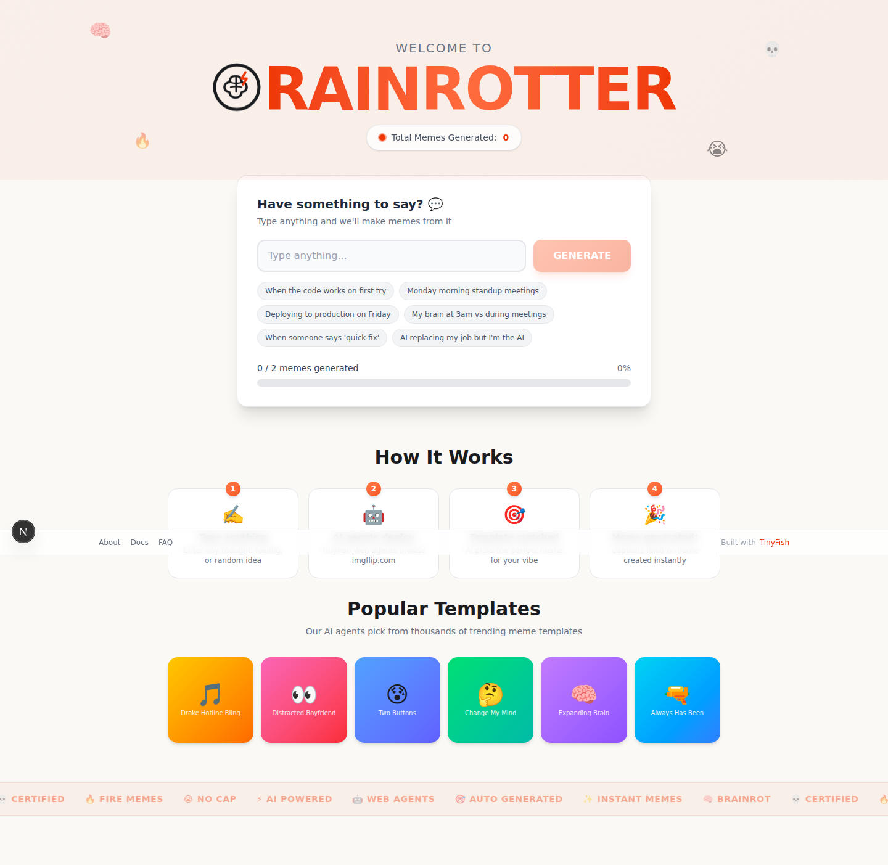
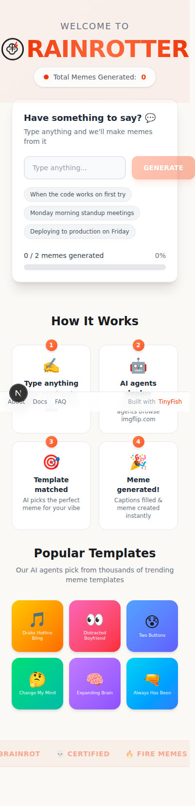

# Brainrotter - AI Meme Generator

AI-powered meme generator built with [TinyFish](https://www.tinyfish.ai) web agents. Type anything and we'll make memes from it.

Inspired by [brainrot.run](https://www.brainrot.run) (Browserbase/Stagehand).

## Screenshots

### Desktop


### Mobile


## How It Works

1. **Type anything** - Enter any thought, feeling, or random idea
2. **AI agents deploy** - TinyFish web agents browse imgflip.com
3. **Template matched** - AI picks the perfect meme template for your vibe
4. **Meme generated** - Captions are auto-filled and meme is created instantly

## Tech Stack

- **Next.js 16** - React framework
- **TinyFish** - AI web agent API for browser automation
- **Tailwind CSS** - Styling
- **Framer Motion** - Animations
- **TypeScript** - Type safety

## Getting Started

1. Clone the repo
2. Install dependencies:
   ```bash
   npm install
   ```
3. Create `.env.local` with your TinyFish API key:
   ```
   TINYFISH_API_KEY=your_api_key_here
   ```
4. Run the dev server:
   ```bash
   npm run dev
   ```
5. Open [http://localhost:3000](http://localhost:3000)

## Project Structure

```
app/
├── api/
│   ├── generate/route.ts     # Meme generation via TinyFish SSE
│   └── meme-count/route.ts   # Meme counter
├── components/               # UI components
├── config/constants.ts       # Configuration
├── about/page.tsx            # About page
├── docs/page.tsx             # Documentation
├── faq/page.tsx              # FAQ
├── globals.css               # Global styles + animations
├── layout.tsx                # Root layout
└── page.tsx                  # Home page
lib/
├── tinyfish.ts               # TinyFish API helper
└── utils.ts                  # Utility functions
```

## Environment Variables

| Variable | Required | Description |
|----------|----------|-------------|
| `TINYFISH_API_KEY` | Yes | TinyFish API key from [tinyfish.ai](https://www.tinyfish.ai) |
| `PRODUCTION_URL` | No | Production URL for meme counter |

## Deploy

Deploy on [Vercel](https://vercel.com) or any platform that supports Next.js. Set the `TINYFISH_API_KEY` environment variable in your deployment settings.
